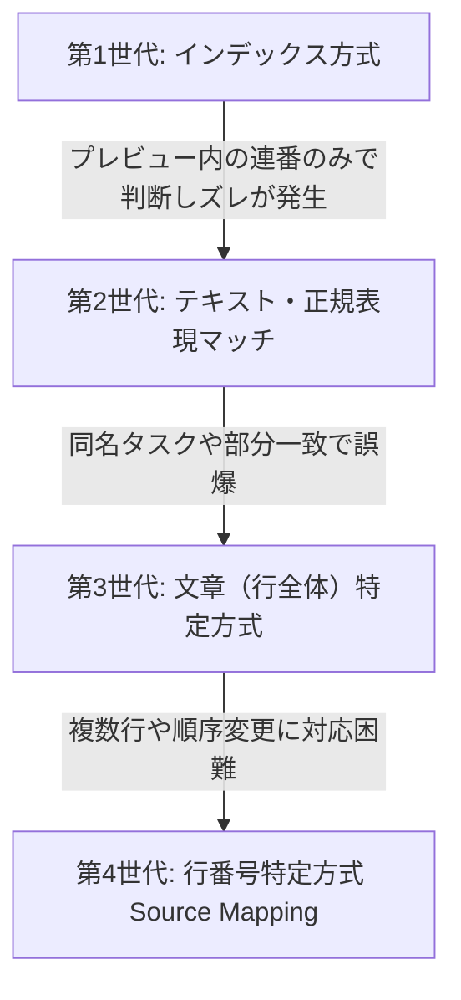

# Simplenote クローン開発レポート：02. インタラクティブ・チェックボックスのズレ問題と解決

本レポートでは、マークダウンプレビュー画面からチェックボックス（タスクリスト `- [ ]` / `- [x]`）を直接クリックして元データをリアルタイムに変更する機能で発生した、更新位置の「ズレ」問題と、それを完璧に克服したデバッグの歴史を記録します。

---

## 1. 問題の発生：インタラクティブ・チェックボックスの「ズレ」

Markdownプレビュー画面に表示されたチェックボックスをクリックすると、対応するエディタ（元のマークダウン文字列）のチェック状態（`[ ]` と `[x]`）が書き換わる「インタラクティブ・チェックボックス」機能を実装しました。

しかし、開発が進むにつれ、以下のような深刻なバグに直面しました。
> **「2番目のチェックボックスをクリックしたのに、1番目が書き換わってしまう」**
> **「チェックボックスの間に通常のテキストやリストが挟まると、書き換え位置がズレて関係ない場所を破壊してしまう」**

---

## 2. 解決に向けた4段階の技術的アプローチ

このズレを克服するため、開発プロセスではアプローチが次々とアップデートされ、より堅牢なロジックへと昇華していきました。

### 第1世代：インデックス（DOM連番）方式
- **アプローチ**: プレビュー内のすべての `<input type="checkbox">` を取得し、「何番目のチェックボックスか」というインデックスを使ってマークダウン文字列内の `[ ]` を順番に数えて置換する。
- **挫折の原因**: マークダウンパーサー（`react-markdown` や `rehype-sanitize`）の処理中で、通常のマークダウンプレビュー用のチェックボックス以外（例：不要なプレビュー生成中の余計な要素など）を数えてしまい、インデックスがずれる問題が多発。

### 第2世代：テキスト・正規表現マッチ
- **アプローチ**: チェックボックスのある行のテキスト文字列を抽出し、そのテキストをキーワードとしてマークダウン中から正規表現で検索し置換する。
- **挫折の原因**: 同じテキストのタスク（例：`- [ ] 買い物` が2個ある場合）が存在した際に、1つ目のチェックボックスをクリックしただけで両方、あるいは意図しない側が書き換わってしまう「同名タスク誤爆」が発生。また、正規表現が「欲張り」になりすぎて無関係な行を巻き込む現象も。

### 第3世代：文章（行全体）特定方式
- **アプローチ**: チェックボックスに付随する「行全体」のプレーンテキストを完璧に一致させて検索する。
- **課題**: `react-markdown` でレンダリングされた後の HTML DOM から、元のマークダウンにおける「正確な1行」を取り出すことが、HTML タグの入れ子（`<li>` や ``）のせいで非常に困難。

### 第4世代（決定版）：行番号特定方式（Source Mapping）
- **アプローチ**: レンダリング時に、各チェックボックスが「元マークダウンの何行目（1-based index）に位置しているか」を要素の `data-line-number` 属性として埋め込む手法。
- **実装の仕組み**:
  1. `remark-gfm` や独自の `remark` プラグイン、またはパースヘルパー（`utils/helpers.ts`）を利用し、プレビューの HTML 要素に元のマークダウンの行番号をマッピング（Source Map）。
  2. プレビューのチェックボックスがクリックされた際、その DOM 要素から行番号（例: `data-line-number="12"`）を取得。
  3. 元マークダウンの「12行目」ピンポイントに対してのみ、`[ ]` ⇄ `[x]` の置換処理を行う。
- **結果**: この手法により、同名タスクがいくらあっても、間に改行や無関係な記述が挟まっても、完全に**「ピンポイントの行」**だけを安全に書き換えることに成功しました。

---

## 3. Rehype / Sanitize との闘い

行番号特定方式を導入する過程で、Next.jsのマークダウン描画エンジンである `rehype` と `rehype-sanitize` のセキュリティフィルターが障壁となりました。

- **問題**: `rehype-sanitize` はセキュリティ（XSS対策）のため、HTMLタグに付与した独自の `data-line-number` や `data-line` などのカスタム属性をレンダリング時に強制的に削除（クレンジング）してしまう。
- **解決策**:
  - `rehype-sanitize` のスキーマ設定をカスタマイズ（オーバーライド）し、`data-*` 属性（特に `data-line-number`）を削除対象から除外（許可リストへ登録）するように設定。
  - あるいは、プレビュー上のチェックボックス描画ロジックにおいて、サニタイズされた後の DOM 構築タイミングでズレをなくすため、コンポーネント構造の最適化を実施。

---

## 成果と学習ポイント
- **技術的ブレイクスルー**: 「画面上の表示」と「背後のプレーンデータ」の不整合を解消する手段として、コンパイル言語やツールが使う **Source Mapping（ソースマップ）** と同じ哲学をアプリケーションのUIデバッグに適用できたこと。
- **サニタイズ処理の理解**: セキュリティライブラリ（`rehype-sanitize`）の挙動、および属性のホワイトリスト化に関する深い知識を獲得。
- **粘り強い検証**: ログからは、開発者が何度もテストデータを走らせ、コンソールログからマッチングの挙動を確認し、一歩一歩原因を突き止めていく素晴らしいデバッグ姿勢が見て取れます。
