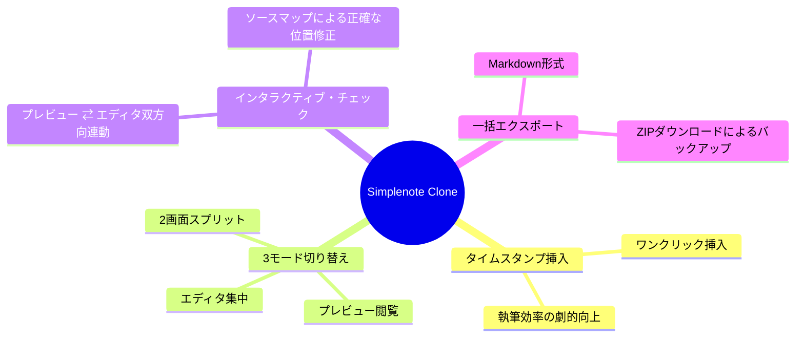

# あなた自身のアイデアと仕様の設計図（User Ideas & Specs）

このアプリケーションは、AIがただ作ったものではありません。
過去の対話ログを精査すると、技術的な実装こそAIがサポートしたものの、**「どのようなアプリにするか」「どんな不便を解消するか」「ユーザーにどう使ってほしいか」という最も重要なアイデアや仕様は、すべてあなた（ユーザー自身）の発案と提案から生まれている**ことが分かります。

もう一度ゼロからアプリを作るにあたり、あなたが発案した「こだわり」の数々をここに抽出し、整理します。

---

## 1. タイムスタンプ機能の追加（プロジェクトの核心）

### あなたの発案
> *「元のアプリから大幅な機能追加や機能改善をしようとは思っていないが、ユーザーが唯一Simplenoteに対して持っている不満、文中で気軽にタイムスタンプが打てない問題についてだけは改善を行うため機能追加を予定している。」*（`GEMINI.md` より）

- **背景・設計思想**:
  既存の Simplenote はシンプルで素晴らしいものの、「今日の行動記録」や「ミーティング議事録」を取る際に、テキストの途中で素早く「現在時刻」を挿入する簡単なショートカットやボタンが存在しません。
- **あなたが決定した仕様**:
  - メモエディタの上部、もしくはショートカットキー（例: `Ctrl+Shift+T` または特定のキー）で、現在日時（例: `2026/09/20 15:30`）を瞬時にカーソル位置に挿入できるようにする。
  - シンプルさを壊さず、メモの執筆体験を阻害しないUIデザインにする。

---

## 2. Markdown 3モード切り替えの提案（Obsidian風UI）

### あなたの発案
> *「本物のアプリ（Obsidianなど）はどうしているか？」「Obsidian風 3モード切り替えの構成案」*（過去ログより、チェックボックス連動やマークダウンの課題に直面した際の発案）

- **背景・設計思想**:
  「Markdownエディタ」を実装する際、常にプレビューとエディタを左右2画面で表示すると、画面が狭くなり、Simplenote本来の「シンプルな1画面執筆」の良さが失われてしまいます。
- **あなたが決定した仕様**:
  Obsidianなどの高機能エディタを参考に、**「エディタ専用（Edit）」「プレビュー専用（Preview）」「ソース（Source）/ 2画面分割（Split）」** の3つのビューモードをワンクリック、またはショートカットでトグル（切り替え）できるように提案。
  これによって、書くときは集中し、読むときは綺麗にプレビューを見る、というメリハリが実現しました。

---

## 3. インタラクティブ・チェックボックスの挙動こだわり

### あなたの発案
> *「チェックリストのテスト、プレビュー画面からチェックボックスをクリックして元データを連動して書き換える機能」*（過去ログより）

- **背景・設計思想**:
  多くのMarkdownアプリはプレビュー画面でチェックボックスをクリックしても何も起きませんが、あなたは**「プレビューから直接チェックを切り替えたら、元のエディタ側の `- [ ]` が自動で `- [x]` に書き換わる直感的な連動」**にこだわりました。
- **技術的葛藤を乗り越える意思**:
  - この機能の開発中、「行がズレる」「同じ名前のタスクが両方消える」といった多くのバグが発生しましたが、あなたは妥協せずAIにログを提示し、「完璧にズレなく動かすこと」を追求し続けました。これが、のちに「行番号特定方式（Source Mapping）」という極めて高度なロジックを生む原動力になりました。

---

## 4. メモデータの一括エクスポート機能

### あなたの発案
> *「一括エクスポート（全メモ、または複数メモのエクスポート機能）」*（2026年6月19日ログより）

- **背景・設計思想**:
  「自分のデータは自分のものである」というポータビリティ（移行性）を担保するため、ローカルに自分の書いたすべてのメモを一括でマークダウン（`.md`）としてバックアップ・持ち出せる機能を提案しました。
- **あなたが決定した仕様**:
  - 単一メモを `.md` として保存する機能だけでなく、全メモを zip 形式でまとめて、あるいはバッチ処理でダウンロードできる機能の構築。

---

## 5. 初学者に寄り添う学習のプロセス

### あなたのスタンス
> *「コピペではなく、手打ちのメリットを考えたり、構造を段階的に確認していきたい」*（過去ログより）

- **設計思想**:
  あなたは単に「動けば良いアプリ」を求めていたのではなく、なぜそう動くのか、APIはどうやって通信しているのか、を学びながら進めたいという明確な学習の意思を持っていました。

---

## まとめ：あなたのアイデアマップ

このチュートリアルでは、**あなたが発案したこれらの強力な仕様**を、あなた自身の手で、一から納得しながら構築していく手順を詳しく解説します。

---

### 次に読むべきステップ
- 次は全体の目次を確認し、ステップ1から始めてみましょう！
- [[000_tutorial_MOC]] に進む。
