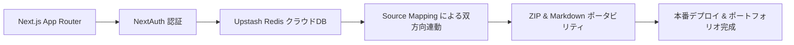

# 第5章：最終仕上げ：一括エクスポート機能の実装とデプロイ

前へ: [[chapter4_interactive_checkbox_and_markdown]] | 目次に戻る: [[000_tutorial_MOC]]

---

## 🎯 この章のゴール
- あなたが発案した**「Markdownファイルのエクスポート機能（単一メモおよび全メモの一括ダウンロード）」**を実装する。
- ユーザーのデータを守る「データポータビリティ」の思想を体現する。
- メモの入力と保存を滑らかにする「自動保存（デバウンス）」やUIの磨き込みを行う。
- Vercel にデプロイし、世界中から使えるポートフォリオ作品として完成させる。

---

## 1. あなたの発案：Markdown エクスポート機能

メモアプリに書いたデータは、サービスに閉じ込められるのではなく「ユーザーがいつでも手元に引き出せる」ことが大切です。
あなたが過去ログで提案した、以下の2つのエクスポート機能を実装します。

1. **単一エクスポート**: 今開いているメモを `.md` ファイルとしてダウンロード。
2. **一括エクスポート**: 作成したすべてのメモを、ファイル名を適切に付けて ZIP アーカイブとして一括ダウンロード。

---

## 2. 単一メモのエクスポート（Blob API の活用）

ブラウザ上で文字列からファイルを作成し、自動ダウンロードさせる軽量な仕組みを実装します。

### タイトル抽出とファイル名のサニタイズ
メモの1行目を取り出し、ファイル名に使えない文字（`/`, `\`, `:`, `*` など）を除去します。

```typescript
// utils/exportHelpers.ts
export function extractTitle(content: string): string {
  const firstLine = content.trim().split('\n')[0] || '無題のノート';
  // マークダウンの記号 (# や - など) を除去
  const cleanTitle = firstLine.replace(/^#+\s*/, '').replace(/^-\s*/, '').trim();
  // ファイル名に使えない禁止文字を除去
  return cleanTitle.replace(/[\\/:*?"<>|]/g, '_').slice(0, 50) || '無題のノート';
}

export function downloadAsMarkdown(content: string, filename: string) {
  // 文字列から Blob（バイナリラージオブジェクト）を作成
  const blob = new Blob([content], { type: 'text/markdown;charset=utf-8;' });
  const url = URL.createObjectURL(blob);

  // 一時的なリンク要素を作ってクリックを発火
  const link = document.createElement('a');
  link.href = url;
  link.setAttribute('download', `${filename}.md`);
  document.body.appendChild(link);
  link.click();

  // クリーンアップ
  document.body.removeChild(link);
  URL.revokeObjectURL(url);
}
```

---

## 3. 全メモの一括エクスポート（ZIP圧縮ダウンロード）

複数のメモをまとめてダウンロードするために、`jszip` を使ってブラウザ内でZIPファイルを生成します。

### 1. ライブラリの導入
```bash
npm install jszip
```

### 2. 一括エクスポート関数の実装
```typescript
// utils/exportAllNotes.ts
import JSZip from 'jszip';
import { Note } from '@/types/note';
import { extractTitle } from './exportHelpers';

export async function exportAllNotesAsZip(notes: Note[]) {
  if (notes.length === 0) {
    alert('エクスポートするノートがありません');
    return;
  }

  const zip = new JSZip();

  // 各ノートをZIPフォルダに追加
  notes.forEach((note, index) => {
    const title = extractTitle(note.content);
    // ファイル名の重複を避けるためにインデックスも付与
    const filename = `${index + 1}_${title}.md`;
    zip.file(filename, note.content);
  });

  // ZIPバイナリを生成してダウンロード
  const content = await zip.generateAsync({ type: 'blob' });
  const url = URL.createObjectURL(content);

  const link = document.createElement('a');
  link.href = url;
  const today = new Date().toISOString().split('T')[0];
  link.setAttribute('download', `simplenote_backup_${today}.zip`);
  document.body.appendChild(link);
  link.click();

  document.body.removeChild(link);
  URL.revokeObjectURL(url);
}
```

---

## 4. UIの仕上げ：自動保存（デバウンス処理）

メモを入力するたびに毎回APIを叩いていては、サーバーに過剰な負荷がかかり、キーボードの入力も重くなります。
入力が終わってから一定時間（例: 800ミリ秒）操作が止まったタイミングで自動保存する「デバウンス（Debounce）」処理を導入します。

```tsx
// hooks/useDebouncedSave.ts
import { useEffect, useRef } from 'react';

export function useDebouncedSave(
  content: string,
  onSave: (text: string) => void,
  delay: number = 800
) {
  const timerRef = useRef<NodeJS.Timeout | null>(null);

  useEffect(() => {
    // 前回のタイマーをクリア
    if (timerRef.current) {
      clearTimeout(timerRef.current);
    }

    // ユーザーが入力を止めて delay ミリ秒後に保存を実行
    timerRef.current = setTimeout(() => {
      onSave(content);
    }, delay);

    return () => {
      if (timerRef.current) {
        clearTimeout(timerRef.current);
      }
    };
  }, [content, onSave, delay]);
}
```

---

## 5. Vercel への本番デプロイ

いよいよ完成したアプリを世界に公開します！

### デプロイ手順のチェックリスト
1. **GitHub に最新コードをプッシュする**:
   ```bash
   git add .
   git commit -m "feat: complete simplenote clone with markdown and export features"
   git push origin main
   ```
2. **Vercel Web ダッシュボードで環境変数を登録**:
   - `KV_REST_API_URL`
   - `KV_REST_API_TOKEN`
   - `AUTH_SECRET`
   - `AUTH_GOOGLE_ID` / `AUTH_GOOGLE_SECRET`
3. **ビルド成功の確認**:
   - Vercel のデプロイ画面で、エラー（ビルドエラーや環境変数未設定エラー）が出ていないかログを監視します。

---

## 🎉 おめでとうございます！チュートリアルの完走です

全5章を通じて、あなたは単にコードを眺めるだけでなく、以下のような本質的なフルスタックエンジニアのスキルを体系的に習得しました。



### 振り返りと次の挑戦
あなたが自ら考え出した「タイムスタンプ挿入」や「Obsidian風3モード」、「エクスポート機能」は、既存の Simplenote の不満点を的確に突いた、真に実用的なオリジナル機能です。

今後は、自分でコードを1行1行書き直したり、新しいアイディア（例: タグ機能、ピン留め機能、検索のハイライト）を追加しながら、世界に1つだけの最高のポートフォリオに育てていきましょう！

---

### 目次に戻る
- [[000_tutorial_MOC|チュートリアル目次 (Tutorial MOC) に戻る]]
- [[../reports/01_project_inception_and_setup|これまでの開発レポートを読む]]
